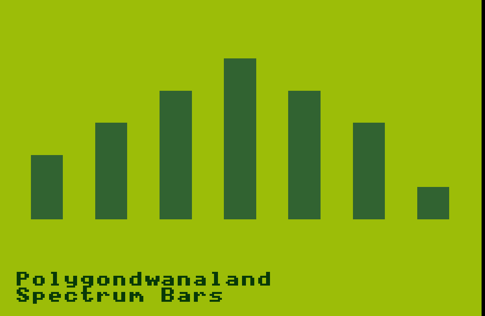

# PolygonGBA 🎵

A Game Boy Advance album player featuring King Gizzard & The Lizard Wizard's *Polygondwanaland* with real-time audio visualizations.



## 🎮 What is PolygonGBA?

PolygonGBA transforms your Game Boy Advance into a portable music player, complete with:

- **Full Album Playback**: Complete *Polygondwanaland* album, 
- **Real-Time Visualizations**: Spectrum analyzer, waveform, and an album cover display view.


### Playing the Album

1. Load `polygondwanaland_side_a_8ad.gba` or `polygondwanaland_side_b_8ad.gba` in your GBA emulator or flash cart
2. Use controls to navigate:
   - **A**: Play/Pause
   - **Left/Right**: Previous/Next track
   - **Up/Down**: Switch views


## 🎵 Album Structure

### Side A (4 tracks, ~10.8MB)
1. Crumbling Castle
2. Polygondwanaland  
3. The Castle In The Air
4. Deserted Dunes Welcome Weary Feet

### Side B (6 tracks, ~15.2MB)
5. Inner Cell
6. Loyalty
7. Horology  
8. Tetrachromacy
9. Searching...
10. The Fourth Colour

*Total album duration: ~40 minutes*

## 🔧 Technical Architecture

### Audio System
- **Codec**: 8AD (Pin Eight ADPCM) for efficient compression (~6% CPU usage)
- **Sample Rate**: 18,157 Hz mono
- **Compression**: ~4:1 ratio (525MB → 26MB total)
- **Playback**: Hardware-accelerated Direct Sound with double buffering

### Graphics System  
- **Display Mode**: MODE_0 tiled backgrounds + sprites
- **Views**: 
  - Real-time spectrum analyzer using Fast Fourier Transform
  - Waveform display with amplitude analysis
  - Static album cover display (128×128)
- **Colors**: Authentic original Game Boy green palette with secret full color mode 👀

### Memory Management
- **VRAM**: Optimized tile and sprite allocation 
- **IWRAM**: Critical audio decoding functions
- **ROM**: GBFS embedded filesystem with audio data

## 📁 Project Structure

```
polygonGBA/
├── source/                 # C source code
│   ├── main.c             # Main application loop
│   ├── 8ad_player.*       # 8AD audio system
│   ├── spectrum_visualizer.* # FFT-based visualizer
│   ├── waveform_visualizer.* # Waveform display  
│   └── album_cover.*      # Album artwork display
├── album_source/          # Original WAV files
├── album_processed/       # Converted 8AD audio
├── tools/                 # Build tools (8AD encoder, GBFS)
├── docs/                  # Technical documentation
└── build_*.sh            # ROM building scripts
```

## 🎨 Visualizations

### 1. Spectrum Analyzer
- Real-time FFT analysis of audio stream
- 16 frequency bands with logarithmic scaling
- Animated bars with peak hold and decay
- Hardware sprite-based rendering

### 2. Waveform Display  
- Live audio waveform visualization
- Amplitude based on audio signal strength
- Smooth scrolling effect
- Optimized for GBA's 240×160 resolution

### 3. Album Cover
- 128×128 album artwork bmp 


## 🔬 Technical Highlights

### Audio Processing Pipeline
```
Original WAV → Sox Resampling → 8AD Encoding → GBFS Packaging → ROM Integration
```

### Why 8AD Over GSM?
- **CPU Efficiency**: 6% vs 70% CPU usage  
- **Real-time Performance**: Leaves headroom for visualizations
- **Quality**: ADPCM provides excellent voice/music quality
- **Proven Technology**: Based on Pin Eight's mature implementation

### Memory-Mapped Audio Architecture  
- **Double Buffering**: Seamless playback with 608-byte buffers
- **VBlank Synchronization**: Audio/video sync at 60 FPS
- **DMA Transfers**: Hardware-accelerated sample feeding
- **Timer-based Playback**: Precise 18,157 Hz sample rate

## 📚 Documentation

This project was made with AI assistance and I kept track of major decisions and debugging results via specs. If you fork this project to develop further, it would likely be useful for you and/or your AI helper to review some of them. 
Detailed technical documentation available in `/docs/`:

- **[Technical Overview](docs/TECHNICAL_OVERVIEW.md)**: System architecture deep-dive
- **[Audio Implementation](docs/GBA_AUDIO_IMPLEMENTATION_SPEC.md)**: Audio system analysis  
- **[Album Cover System](docs/ALBUM_COVER_IMPLEMENTATION.md)**: Graphics implementation
- **[Build Process](ROM_BUILD_PROCESS.md)**: ROM creation workflow

## 🤝 Development

### Architecture Decisions

**Audio Codec Evolution:**

1. **Custom PGDA**: Too complex, abandoned
2. **GSM**: Great compression but 70% CPU usage  
3. **8AD**: Perfect balance - 6% CPU, 4:1 compression

**Graphics Approach:**
- Hardware sprites for visualizations (smooth 60 FPS)
- Tiled backgrounds for static elements (zero CPU overhead)
- Optimized VRAM usage with dedicated memory regions

### Performance Optimizations
- **IWRAM Code**: Critical functions in fast internal RAM
- **VBlank Timing**: All updates synchronized with display refresh  
- **Efficient Algorithms**: Fast FFT and optimized sprite management
- **Caching**: Reduced function call overhead in main loop

## 🎮 Compatibility

- Tested on mGBA and a Game Boy Advance SP

## 📜 Acknowledgements

This project would not have been possible at all without the open source technologies created by the homebrew community: 
-  **Damien Yerrick's** (Pin Eight) Game Boy File System and 8AD codec were crucial building blocks for this project. 
- Developing for the GBA is far more accesible thanks to **DevkitPro**. 
- **GSM-Player-GBA** served as an immensly helpful reference when designing the audio pipeline
- **TONC** for its incredibly detailed description of GBA architecture which helped me understand what was going on. 

And of course,

My endless gratitude to King GIzzard & the Lizard Wizard for all of their incredible music, and for releasing *Polygondwanaland* under Creative Commons, encouraging their fans to make their own copies. 


### Development
This project demonstrates GBA programming techniques including real-time audio processing, hardware-accelerated graphics, and efficient memory management.

🦎🧙‍♂️